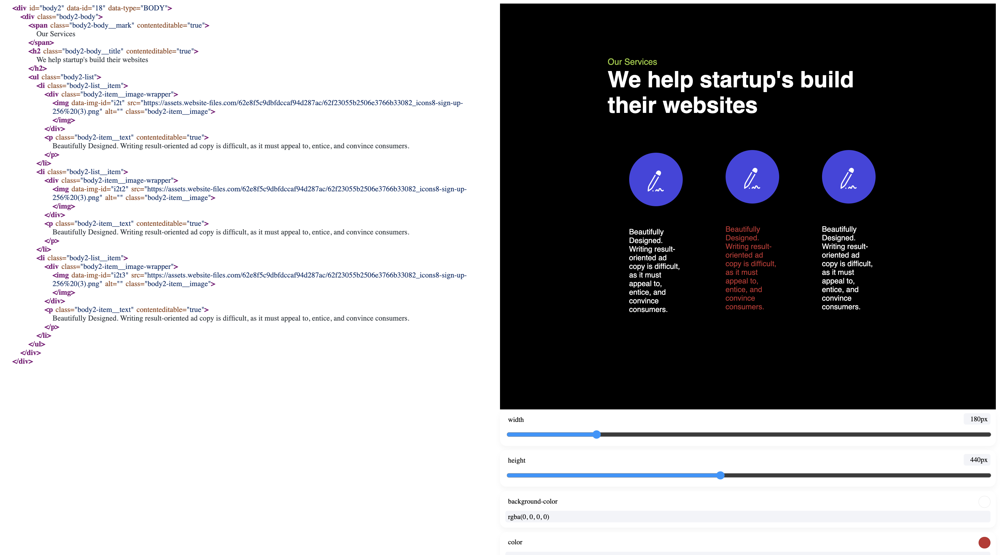

# Gui parser

[try it](https://bogdanq.github.io/gui-parser)

Проект помогает писать парсеры. Парсит и возвращает структуру любого дерева (имитация панели разрабочика), позволяет изменять стили выбранного в дереве елемента
